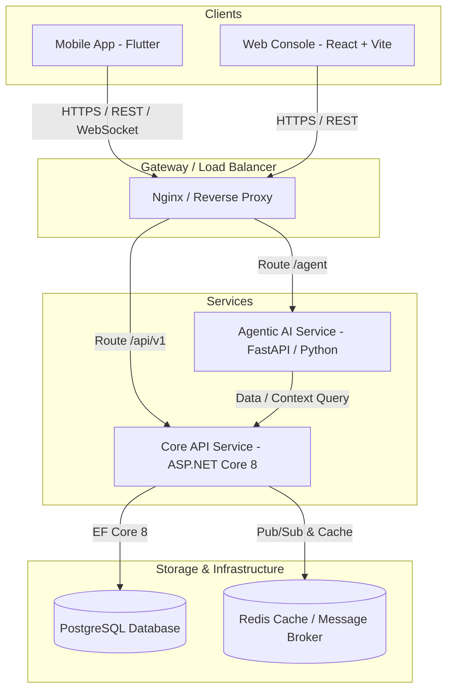

# QuickPark: Smart, Secure & Scalable Parking Platform

[](https://opensource.org/licenses/MIT)
[](https://dotnet.microsoft.com/)
[](https://reactjs.org/)
[](https://flutter.dev/)
[](https://fastapi.tiangolo.com/)
[](https://www.postgresql.org/)
[](https://www.docker.com/)

**QuickPark** is an enterprise-grade, multi-tenant parking reservation and management ecosystem. It seamlessly connects Drivers, Parking Owners, Operational Staff, and Administrators through real-time availability tracking, dynamic QR token verification, automated payments, and AI-driven assistant tools.

---

## Table of Contents

- [Overview & Architecture](#overview--architecture)
- [System Components & Services](#system-components--services)
- [Technology Stack](#technology-stack)
- [Key Features](#key-features)
- [Getting Started](#getting-started)
  - [Prerequisites](#prerequisites)
  - [Environment Configuration](#environment-configuration)
  - [Quick Start with Docker Compose](#quick-start-with-docker-compose)
  - [Manual Service Setup](#manual-service-setup)
- [API Documentation](#api-documentation)
- [Testing & Quality Assurance](#testing--quality-assurance)
- [Deployment & DevOps](#deployment--devops)
- [Security Architecture](#security-architecture)
- [Contributing](#contributing)
- [License](#license)

---

## Overview & Architecture

QuickPark adopts a modern micro-service & modular architecture designed for horizontal scalability, zero-downtime operations, and robust role-based security.



---

## System Components & Services

| Directory | Service / Component | Description | Tech Stack |
| :--- | :--- | :--- | :--- |
| `backend/` | **Core Web API** | Business logic, JWT auth, parking reservation, payments, and RBAC endpoints | .NET 8, EF Core, PostgreSQL |
| `agent-service/` | **AI Agent Service** | Natural language processing, parking recommendations, and intelligent query execution | FastAPI, Python 3.11+, LangChain / OpenAI |
| `frontend-web/` | **Web Management Portal** | Admin & Owner management dashboard, spot configuration, analytics, staff panel | React 18, TypeScript, Tailwind CSS |
| `mobile_app/` | **Mobile Application** | Customer app for discovering spots, making reservations, dynamic QR token display | Flutter 3.x, Dart |
| `e2e/` | **End-to-End Tests** | Cross-platform automated integration and user scenario tests | Playwright |
| `performance_tests/` | **Performance Tests** | Load testing, stress testing, and throughput benchmarks | k6 |

---

## Technology Stack

### Backend & APIs
- **Framework:** ASP.NET Core 8 Web API
- **ORM & Migrations:** Entity Framework Core 8
- **Database:** PostgreSQL 16
- **Authentication:** JWT (JSON Web Tokens) with Access & Refresh Token rotation
- **Caching & Messaging:** Redis

### AI & Agent Service
- **Framework:** FastAPI (Python 3.11+)
- **AI Core:** Agentic AI workflow for natural language booking queries and intelligent search
- **API Specs:** Swagger / OpenAPI 3.0

### Frontend & Mobile
- **Web App:** React 18, TypeScript, Vite, Tailwind CSS
- **Mobile App:** Flutter 3.x (iOS & Android)
- **State Management:** Redux Toolkit / React Query (Web), Provider / BLoC (Mobile)

### DevOps & Infrastructure
- **Containerization:** Docker & Docker Compose
- **CI/CD:** GitHub Actions
- **API Testing:** Postman, Swagger UI

---

## Key Features

### 1. Smart Discovery & Real-Time Booking
- Real-time geolocation-based search for nearest available parking spots.
- Live vacancy status, hourly/daily pricing rate comparisons, and spot reservation locks.

### 2. Dynamic QR Token Verification
- Instant cryptographic QR code generation upon successful reservation.
- On-site staff mobile scanner interface for quick check-in / check-out verification.

### 3. Agentic AI Parking Assistant
- Natural language query handling (e.g., "Find me parking near City Center under $5/hr for tomorrow morning").
- Smart automated reservation creation and contextual guidance.

### 4. Multi-Tenant Owner & Operational Management
- **Owners:** Add/manage facilities, configure slot availability, dynamic pricing, track revenue.
- **Staff:** Scan entry tokens, validate parking status, monitor live facility occupancy.
- **Admins:** Platform-wide analytics, user audit logs, system security monitoring.

---

## Getting Started

### Prerequisites

Ensure you have the following installed on your developer machine:
- [Docker Desktop](https://www.docker.com/products/docker-desktop/) (v24.0+)
- [.NET 8 SDK](https://dotnet.microsoft.com/download/dotnet/8.0)
- [Node.js](https://nodejs.org/) (v18+ or v20+) & `npm`
- [Flutter SDK](https://docs.flutter.dev/get-started/install) (v3.16+)
- [Python](https://www.python.org/) (v3.11+)

---

### Environment Configuration

1. Clone the repository:
   ```bash
   git clone https://github.com/Vinod-Rajapaksha/QuickPark.git
   cd QuickPark
   ```

2. Copy the example environment file and configure variables:
   ```bash
   cp .env.example .env
   ```

---

### Quick Start with Docker Compose

To launch the complete infrastructure (Database, Core API, Agent Service, and Web Frontend) with a single command:

```bash
docker-compose up -d --build
```

After startup, access the services at:
- **Web Portal:** `http://localhost` (Port 80)
- **Core API:** `http://localhost:8080/swagger`
- **Agent Service Docs:** `http://localhost:8000/docs`
- **PostgreSQL:** `localhost:5432`
- **Redis:** `localhost:6379`

---

### Manual Service Setup

<details>
<summary>Click to expand manual setup instructions for each service</summary>

#### 1. Core Backend Service (.NET 8)
```bash
cd backend
dotnet restore
dotnet build
dotnet run --project QuickPark.API
```

#### 2. AI Agent Service (FastAPI)
```bash
cd agent-service
python -m venv .venv
# On Windows: .venv\Scripts\activate | On Linux/macOS: source .venv/bin/activate
pip install -r requirements.txt
uvicorn app.main:app --reload --port 8000
```

#### 3. Web Frontend (React + Vite)
```bash
cd frontend-web
npm install
npm run dev
```

#### 4. Mobile Application (Flutter)
```bash
cd mobile_app
flutter pub get
flutter run
```

</details>

---

## API Documentation

Interactive API documentation is auto-generated for all microservices:

- **Core ASP.NET Core API:** `http://localhost:8080/swagger`
- **AI Agent API:** `http://localhost:8000/docs` or `http://localhost:8000/redoc`

---

## Testing & Quality Assurance

QuickPark maintains strict quality controls with unit, integration, end-to-end, and performance test suites.

```bash
# Core API Unit & Integration Tests
cd backend && dotnet test QuickPark.Tests

# AI Agent Service Tests
cd agent-service && pytest

# End-to-End Tests (Playwright)
cd e2e && npx playwright test

# Performance Load Tests
cd performance_tests && k6 run k6_planning_test.js
```

---

## Security Architecture

- **Authentication & Authorization:** JWT Access Tokens with HTTP-Only Refresh Tokens and strict Role-Based Access Control (RBAC).
- **Data Protection:** Password hashing, HTTPS TLS encryption in transit, parameterization against SQL Injection.
- **API Security:** CORS origin filtering, rate limiting, and request sanitization middleware.

---

## License

This project is licensed under the **MIT License** - see the [LICENSE](LICENSE) file for details.
